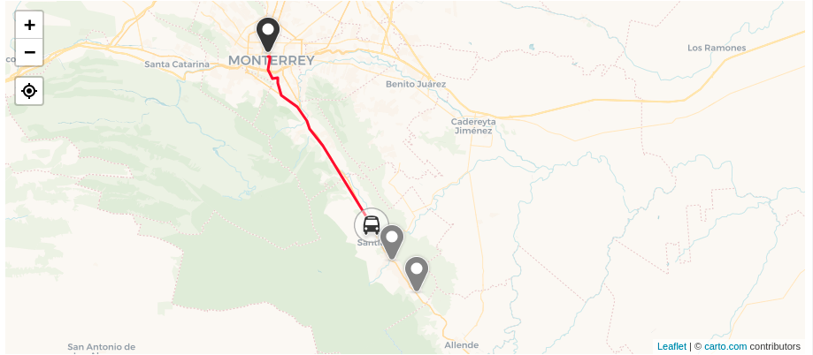

# btrz-map
Library to display a map and live track the position of the bus for a specific trip.

This lib runs in the browser and can be
included in any site.



### Prerequisites
* An account with the premium feature enabled and configured.
* The scanner app (vx.x.x or higher) installed on an Android phone to capture the location of the bus.
* A Betterez public API key.
* You will need to select a map tiles provider, that is, a provider for the map imagery.

#### External Dependencies
This lib is built on top of [leaftlet](https://leafletjs.com/) so you will need  to install 
leaflet 1.7.1 or compatible.

### Installation
#### Directly from your page
* Include Leaflet CSS file in the head section of your document:

```
<link rel="stylesheet" href="https://unpkg.com/leaflet@1.7.1/dist/leaflet.css"
  integrity="sha512-xodZBNTC5n17Xt2atTPuE1HxjVMSvLVW9ocqUKLsCC5CXdbqCmblAshOMAS6/keqq/sMZMZ19scR4PsZChSR7A=="
  crossorigin=""/>
  ```

* Include Leaflet JavaScript file after Leaflet’s CSS:

```
<!-- Make sure you put this AFTER Leaflet's CSS -->
 <script src="https://unpkg.com/leaflet@1.7.1/dist/leaflet.js"
   integrity="sha512-XQoYMqMTK8LvdxXYG3nZ448hOEQiglfqkJs1NOQV44cWnUrBc8PkAOcXy20w0vlaXaVUearIOBhiXZ5V3ynxwA=="
   crossorigin=""></script>
```

* Include btrz-map:
```
<!-- Make sure you put this AFTER Leaflet's JS -->
 TODO
```
#### Or via npm
TODO: publish

``` npm i leaflet@1.7.1 btrz-map```

### Usage
``` html
...
<head>
    ...
    //Make sure to provide at least a height for the map container
    <style>
        #map {
            height: 400px;
        }
    </style>
</head>
<body>
    ...
    <div id="map"></div>
    <h4 id="timezoneNote"></h4>
    ...
</body>
<script>
  // Select the map tiles provider of your choice for the map imagery (e.g Mapbox, Carto, etc)
  // Beware that when using a map tiles they ask you to include the an attribution text on the map.
  // Also most providers offers a free tier, but if you expect a high load you might need to create an account with them
  // Check the provider site for more info.
  // In this example we are using Carto as a map tiles provider.
  const tilesProviderUrl = "https://{s}.basemaps.cartocdn.com/rastertiles/voyager_labels_under/{z}/{x}/{y}.png";
  const attribution = "&copy; <a href=\"https://carto.com\">carto.com</a> contributors";

  const lib = btrzMap.init({env: "sandbox", apiKey: "yourBetterezPublicKey"});
  const map = lib.map({containerId: "map", tilesProviderUrl, attribution});

  let trip = null;

  map.addTrip({
    routeId: "yourRouteId",
    scheduleId: "yourScheduleId",
    date: "YYYY-MM-DD",
    productId: "yourProductId"
  })
  .then((_trip) => {
    trip = _trip;
  })

  // ..after you are done with the map, remove the trip from the map to free resources.
  // map.removeTrip(trip);

  // Optional: All times are showed in local timezone, it is recommended to make it clear somewhere in the page/
  const timezoneDiv = document.getElementById("timezoneNote");
  timezoneDiv.innerHTML = "All times are in  " + Intl.DateTimeFormat().resolvedOptions().timeZone + " time";
</script>
```
### API
Please check the [API docs](docs/API.md)

### Contributing as a developer

#### Run test
```npm test```

#### Build
```npm run build```

#### Push a new version
```npm version [major || minor || patch]```
